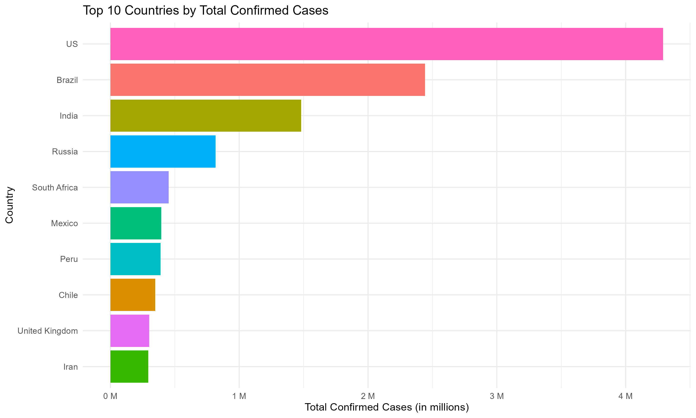

# Analysis of COVID-19 Data Visualizations

 This report details the key findings from the five visualizations generated by the R script, based on the country_wise_latest.csv dataset.

---

## 1. Bar Chart: Top 10 Countries by Confirmed Cases

**Key Finding**: The pandemic's impact, in terms of total cases, is highly concentrated in a few countries.

Detailed Analysis: The United States is a significant outlier, with over 4 million confirmed cases, which is substantially more than any other nation. Brazil and India are the next most-affected countries, both showing case counts over 1 million. The remaining countries in the top 10 (e.g., Russia, South Africa, Mexico) form a cluster at a lower, though still severe, level.



---

## 2.  Pie Chart: Proportion of Confirmed Cases by WHO Region

**Key Finding**: The Americas is the epicenter of the pandemic, accounting for more than half of all global cases.

Detailed Analysis: The pie chart shows that the Americas region alone represents 53.6% of all confirmed cases. This indicates a massive regional concentration. Europe is the next most-affected region at 18.2%, followed by South-East Asia (11.2%). The Western Pacific region, where the pandemic originated, accounts for the smallest share at 2.0%.

---

## 3. Stacked Bar Chart: Regional Case Breakdown

**Key Finding**: The Americas region not only has the most cases, but a very large proportion of them are active, whereas Europe's cases are mostly recovered.

Detailed Analysis: This chart provides crucial context. The bar for the Americas is dominated by a large "Active" case section, suggesting the pandemic is widespread and still in a major growth phase. In contrast, the bar for Europe shows a very large "Recovered" section and a much smaller "Active" section, indicating it was (at the time of this data) largely past the peak of its major wave.

---

## 4. Line Chart: 1-Week Case Growth (Top 10 Countries)

**Key Finding**: The pandemic is still in an active growth phase in all top 10 countries, with some (like South Africa) showing very rapid recent acceleration.

Detailed Analysis: Every country on the chart shows an upward-sloping line, meaning none are seeing a decline in their cumulative case counts. The slopes for the US, Brazil, and India show the largest absolute increases over the week. Notably, South Africa's line is particularly steep, indicating very fast recent growth that propelled it into the top 10.

---

## 5. Histogram: Distribution of Case Fatality Rate (CFR)

**Key Finding**: Most countries have a Case Fatality Rate (CFR) below 5%, but there is a wide spread, indicating significant variation in outcomes.

Detailed Analysis: The histogram is "right-skewed." The tallest bars are on the left, showing that the vast majority of countries have a CFR between 0% and 5%. However, the long "tail" to the right shows that a number of countries have much higher rates (10%, 15%, or more). This variation could be due to differences in testing availability (fewer tests = higher CFR), healthcare system capacity, or the age demographic of the population.


```python

```
